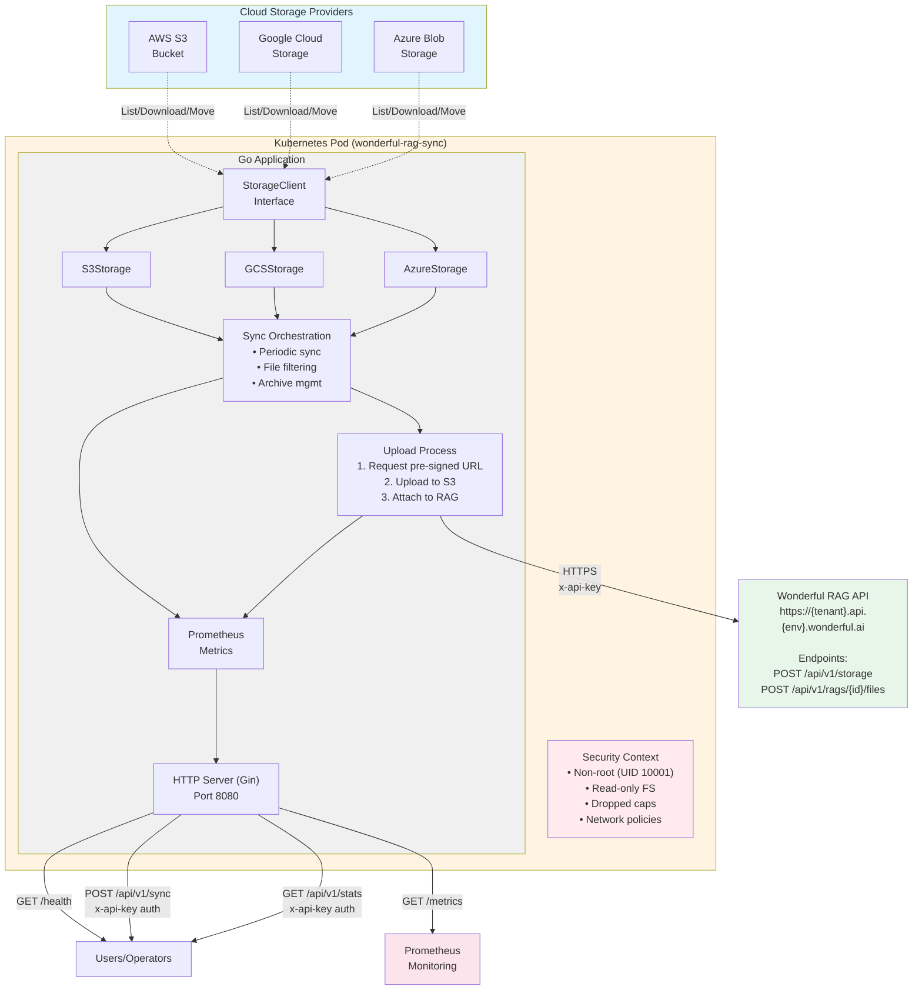
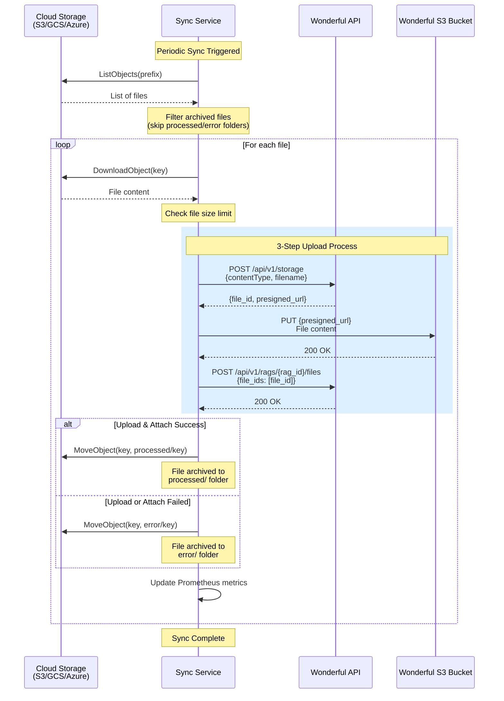

# Architecture Diagram

## Visual Diagram (Mermaid)



## Sequence Diagram: File Upload Process



## System Overview

```
┌──────────────────────────────────────────────────────────────────────────────────────┐
│                              Cloud Storage Providers                                  │
│  ┌──────────────┐         ┌──────────────┐         ┌──────────────┐                 │
│  │   AWS S3     │         │   GCS        │         │   Azure      │                 │
│  │   Bucket     │         │   Bucket     │         │   Blob       │                 │
│  │              │         │              │         │   Storage    │                 │
│  └──────┬───────┘         └──────┬───────┘         └──────┬───────┘                 │
│         │                        │                        │                          │
│         └────────────────────────┴────────────────────────┘                          │
│                                  │                                                    │
└──────────────────────────────────┼────────────────────────────────────────────────────┘
                                   │
                                   │ List/Download/Move Objects
                                   │
                    ┌──────────────▼──────────────────────────────────────────────┐
                    │         Kubernetes Pod (wonderful-rag-sync)                │
                    │                                                             │
                    │  ┌───────────────────────────────────────────────────────┐ │
                    │  │         Go Application (main.go)                      │ │
                    │  │                                                       │ │
                    │  │  ┌─────────────────────────────────────────────────┐ │ │
                    │  │  │     StorageClient Interface                     │ │ │
                    │  │  │  ┌──────────┐ ┌──────────┐ ┌──────────────┐   │ │ │
                    │  │  │  │S3Storage │ │GCSStorage│ │AzureStorage  │   │ │ │
                    │  │  │  └──────────┘ └──────────┘ └──────────────┘   │ │ │
                    │  │  └─────────────────────────────────────────────────┘ │ │
                    │  │                      │                                │ │
                    │  │  ┌───────────────────▼──────────────────────────────┐ │ │
                    │  │  │      Sync Orchestration                          │ │ │
                    │  │  │  • Background goroutine (periodic sync)          │ │ │
                    │  │  │  • File discovery & filtering                    │ │ │
                    │  │  │  • Archive management (processed/error folders)  │ │ │
                    │  │  │  • File size limit enforcement                   │ │ │
                    │  │  └──────────────────┬───────────────────────────────┘ │ │
                    │  │                     │                                  │ │
                    │  │  ┌──────────────────▼───────────────────────────────┐ │ │
                    │  │  │      Upload Process (3 Steps)                    │ │ │
                    │  │  │  1. Request pre-signed S3 URL                    │ │ │
                    │  │  │     POST /api/v1/storage                         │ │ │
                    │  │  │  2. Upload file to S3 via pre-signed URL         │ │ │
                    │  │  │     PUT {presigned-url}                          │ │ │
                    │  │  │  3. Attach file to RAG                           │ │ │
                    │  │  │     POST /api/v1/rags/{rag_id}/files             │ │ │
                    │  │  └──────────────────┬───────────────────────────────┘ │ │
                    │  │                     │                                  │ │
                    │  │  ┌──────────────────▼───────────────────────────────┐ │ │
                    │  │  │   HTTP Server (Gin Framework) - Port 8080        │ │ │
                    │  │  │                                                   │ │ │
                    │  │  │  Public Endpoints:                                │ │ │
                    │  │  │    GET  /health        - Health check             │ │ │
                    │  │  │    GET  /metrics       - Prometheus metrics       │ │ │
                    │  │  │                                                   │ │ │
                    │  │  │  Protected Endpoints (API Key Auth):              │ │ │
                    │  │  │    POST /api/v1/sync           - Manual trigger  │ │ │
                    │  │  │    GET  /api/v1/stats          - Sync statistics │ │ │
                    │  │  │    GET  /api/v1/processed-files - File list      │ │ │
                    │  │  └───────────────────────────────────────────────────┘ │ │
                    │  │                                                       │ │
                    │  │  ┌─────────────────────────────────────────────────┐ │ │
                    │  │  │      Prometheus Metrics                         │ │ │
                    │  │  │  • wonderful_rag_sync_runs_total                │ │ │
                    │  │  │  • wonderful_rag_files_processed_total          │ │ │
                    │  │  │  • wonderful_rag_files_failed_total             │ │ │
                    │  │  │  • wonderful_rag_sync_duration_seconds          │ │ │
                    │  │  │  • wonderful_rag_last_sync_success              │ │ │
                    │  │  └─────────────────────────────────────────────────┘ │ │
                    │  └───────────────────────────────────────────────────────┘ │
                    │                                                             │
                    │  Security Context:                                          │
                    │  • Non-root user (UID 10001)                                │
                    │  • Read-only root filesystem                                │
                    │  • Dropped capabilities                                     │
                    │  • Network policies (ingress/egress restrictions)           │
                    └─────────────────────────────────────────────────────────────┘
                                   │                           │
                                   │                           │
                    ┌──────────────▼────────────┐    ┌─────────▼──────────┐
                    │  Wonderful RAG API        │    │   Prometheus       │
                    │  https://{tenant}.api.    │    │   (Monitoring)     │
                    │    {env}.wonderful.ai     │    │                    │
                    │                           │    │  • Scrapes /metrics│
                    │  Endpoints:               │    │  • Alerting        │
                    │  • POST /api/v1/storage   │    │  • Dashboards      │
                    │  • POST /api/v1/rags/{id}/│    └────────────────────┘
                    │         files             │
                    │                           │
                    │  Authentication:          │
                    │  • x-api-key header       │
                    └───────────────────────────┘
```

## Data Flow

### File Processing Flow

```
1. List Files
   Storage Provider → StorageClient.ListObjects() → Filter archived files

2. Download File
   Storage Provider → StorageClient.DownloadObject() → File content in memory

3. Upload to Wonderful (3-step process)
   a. Request Pre-signed URL
      Application → POST /api/v1/storage → Wonderful API
      Response: {file_id, presigned_url}

   b. Upload to S3
      Application → PUT {presigned_url} → S3 (Wonderful's bucket)

   c. Attach to RAG
      Application → POST /api/v1/rags/{rag_id}/files → Wonderful API
      Body: {file_ids: [file_id]}

4. Archive File
   Success → Move to {prefix}/processed/
   Failure → Move to {prefix}/error/
```

### Error Handling & Retries

```
HTTP Requests:
├── Exponential backoff with jitter
├── Retry attempts:
│   ├── API calls: 3 attempts
│   └── S3 uploads: 2 attempts
└── Retryable status codes:
    ├── 429 (Too Many Requests)
    └── 5xx (Server Errors)
```

## Configuration

### Environment Variables

```
Storage Provider Selection:
├── STORAGE_PROVIDER: s3|gcs|azure
├── S3_BUCKET, S3_PREFIX (for S3)
├── GCS_BUCKET, GCS_PREFIX (for GCS)
└── AZURE_STORAGE_CONTAINER, AZURE_STORAGE_PREFIX (for Azure)

Wonderful API:
├── WONDERFUL_TENANT (e.g., swiss-german)
├── WONDERFUL_ENV (dev|demo|sb|prod)
├── WONDERFUL_RAG_ID (required, secret)
└── WONDERFUL_API_KEY (required, secret)

Sync Configuration:
├── SYNC_INTERVAL_SECONDS (preferred)
├── SYNC_INTERVAL_MINUTES (fallback)
└── MAX_FILE_SIZE_MB (0 = no limit)

Security:
└── INTERNAL_API_KEY (optional, for API endpoint protection)
```

## Kubernetes Deployment

```
Helm Chart Components:
├── Deployment
│   ├── Single pod replica
│   ├── Resource limits/requests
│   └── Security context (non-root, read-only FS)
├── Secret
│   ├── Inline values (insecure, dev only)
│   └── External secret reference (recommended)
├── Service
│   └── ClusterIP on port 8080
├── NetworkPolicy
│   ├── Ingress: Same namespace only
│   └── Egress: DNS (53), HTTPS (443)
└── PodDisruptionBudget
    └── Ensures availability during maintenance
```

## Security Architecture

```
Pod Security:
├── Non-root user (UID 10001)
├── Read-only root filesystem
├── Dropped capabilities
└── seccompProfile: RuntimeDefault

Network Security:
├── Network policies (ingress/egress filtering)
├── Optional CIDR restrictions for cloud providers
└── Internal API key authentication

Secret Management:
├── Kubernetes secrets
├── External Secrets Operator support
└── Vault/Sealed Secrets compatible
```

## Observability

```
Prometheus Metrics:
├── Sync metrics (runs, duration, status)
├── File metrics (processed, failed, skipped)
└── Labels: provider (s3|gcs|azure)

Logging:
├── Structured JSON logging (logrus)
├── Debug level verbosity
├── Trace IDs (X-Request-Id)
└── File operation tracking

Health Checks:
├── /health endpoint
└── Liveness/readiness probes
```

## Design Principles

1. **Single Responsibility**: All code in one file (~1200 lines) for simplicity
2. **Storage Abstraction**: `StorageClient` interface for multi-cloud support
3. **Idempotency**: Archived files are skipped in subsequent syncs
4. **Error Isolation**: Failed files don't block successful ones
5. **Observability**: Comprehensive metrics and structured logging
6. **Security First**: Non-root, read-only FS, network policies, API key auth
7. **Retry Logic**: Exponential backoff with jitter for transient failures
